# WebDay01_HTML

### html文档的基本结构

**视频源：**04_html文档的基本结构.avi

**需求：** 熟悉html文档的基本结构

**代码:**

```html
<!DOCTYPE html>			//告诉浏览器当前使用的是HTML版本
<html>					//根标签
	<head>	
		<meta charset="utf-8">	//指定编码集要与该html文件的属性编码一致
		<title>彩哥培训班</title>	//定义网页的标题
	</head>
	<body>
      hello html
	</body>
</html>					//在火狐或谷歌浏览器中查看调试html文档
```

**运行结果:**

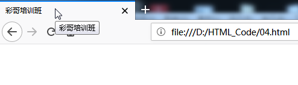

**小细节:**

如果指定的编码集和创建的html文件属性中设置的编码集不同网页的标题会出现乱码

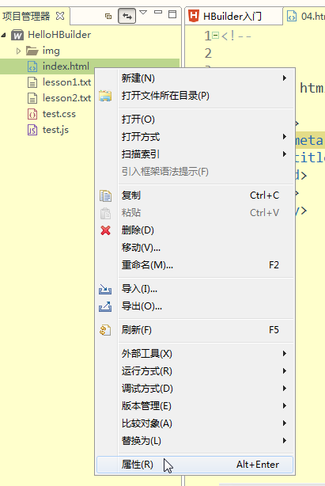

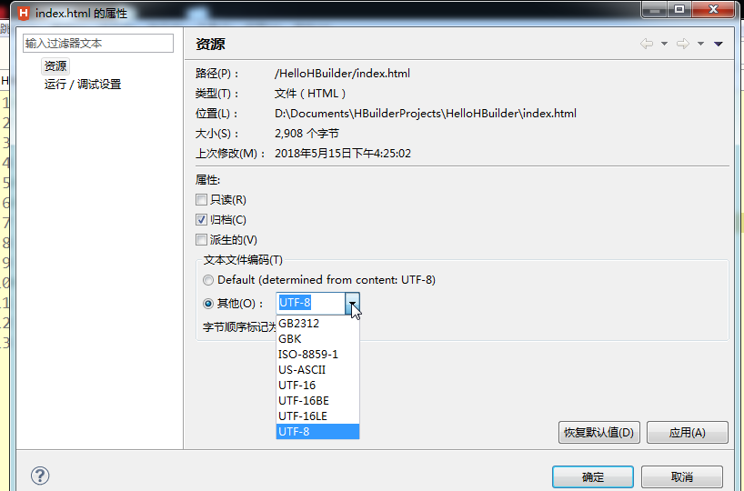

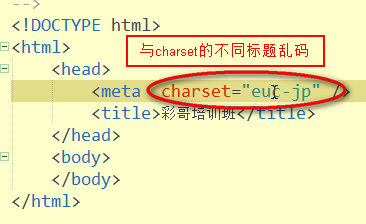

**运行结果:**

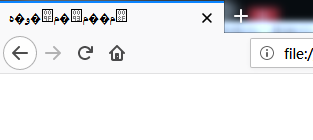

**标签规则**

成对出现;标签要写在标签内;

标签嵌套的顺序:先开始的标签后结束,后开始的标签先结束


**需求:**学会在HTML参考手册中查阅陌生标签

**步骤:**

1.在http://www.w3school.com.cn/中点击HTML/CSS中的HTML教程中的HTML

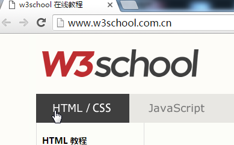

2.下拉至HTML参考手册选择HTML标签列表


3.在其中找到想查找的陌生标签并点击进入

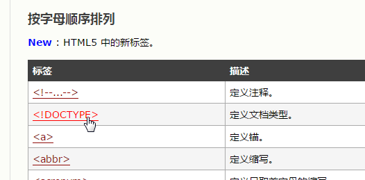

4.首先查看该标签支持哪些浏览器(图标全亮表示支持该浏览器全部版本;图标半亮表示仅支持该浏览器的部分版本;图片全暗表示不支持该浏览器).

其次查看该标签的定义和用法.

最后还可以点击"亲自试一试"测试标签的使用

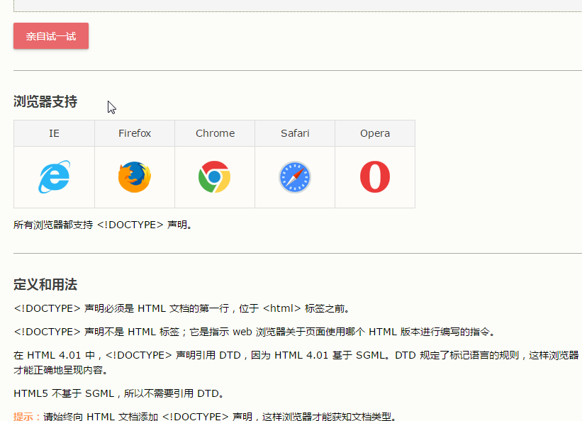


**小细节（注意事项）**

 注意：

注释的快捷键Ctrl+Shift+/ 回车

```html
<!--
添加注释
-->
```

**总结**

重点掌握html文档的基本结构;会在HTML参考手册中查阅陌生标签

------


### 标题标签

**视频源：**05_标题标签.avi

**概念：** 在文本中的标题

**需求：** 掌握标题标签的定义和使用方式; 理解属性的概念和使用格式

**属性的格式:**<标签名 属性名="属性值">

**代码:**

```html
<!DOCTYPE html>
<html>
	<head>
		<meta charset="UTF-8">
		<title>彩哥培训班</title>
	</head>
	<body>
      <h1 align="right">这是一号标题</h1>	//标题与右对齐
      <h2 align="center">这是二号标题</h2>//标题居中对齐
      <h3 align="left">这是三号标题</h3>	//标题左对齐
      <h4>这是四号标题</h4>
      <h5>这是五号标题</h5>
      <h6>这是六号标题</h6>
  	</body>
</html>
```

**运行结果**

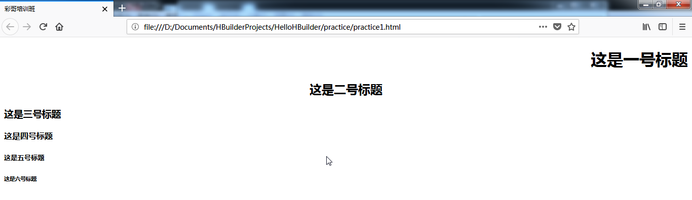

**小细节（注意事项）**

 注意：

写完程序别忘了Ctrl+S保存后再运行Ctrl+R

标题标签一共有6个尺寸,1号标题是最大的

标题独占一行,标题中的字体行间距较大

**总结**

标题标签head<h1~6>,1最大,独占一行

------


### 字体标签

**视频源：**06_字体标签.avi;07_颜色的使用.avi

**概念：** 给文本中的字段设置属性

```html
...
<body>
  	<font>
    属性:color,颜色,如"red"...
    face,字体,如"宋体""楷体"...
    size,字体大小1~7,7最大
```

**概念:**颜色color属性的使用

两个字母为一组用十六进制表示颜色#aabbcc,所有颜色由红绿蓝组成,每种原色的取值范围是00~ff,两个字母相同可缩写省略一个

红色表示为#ff0000 -> 可缩写为#f00

绿色表示为#00ff00 -> 可缩写为#0f0

蓝色表示为#0000ff

黑色表示为#000

**代码:**

```html
<!DOCTYPE html>
<html>
	<head>
		<meta charset="UTF-8">
		<title>彩哥培训班</title>
	</head>
	<body>
		<font color="#f00" size="7" face="楷体">大家好才是真的好</font>
	</body>
</html>
```

**运行结果**

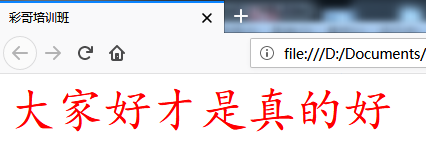

**小细节（注意事项）**

 注意：字体属性中不能设置字段的位置

**总结**

<font>字体标签可设置颜色,字体,大小

------


### body中的其它标签

**视频源：**08_其他标签.avi

**概念：** 段落p\加粗b\斜体i\强调\下划线u\换行br\分割线(页眉)hr

**代码:**

```html
<!DOCTYPE html>
<html>
	<head>
		<meta charset="UTF-8">
		<title>彩哥培训班</title>
	</head>
	<body>
		<p align="left">
			<b>你好我也好</b></br>			//加粗换行
  			<strong>...</strong>			//强调加粗,效果同上,是为了给程序员看的强调那一部分
			<i>你好我也好</i>				//斜体
  			<em>...</em>					//强调斜体,效果同上,为了给程序员看的强调的那一部分
			<u>你好我也好</u>				//下划线
		</p>
		<hr width="80%"/>   				//规定分割线的长度是页面的80%
	</body>
</html>
```

**运行结果**

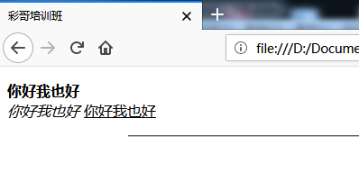

**小细节（注意事项）**

 注意：

加粗和页眉的定义标签只有一个且都带/

**总结**

段落p\加粗b\斜体i\强调\下划线u 可在body中成对使用

换行br可加在每段文字或标签后

hr分割线单独成行使用

------


### 图片标签

**视频源：**09_图片标签.avi

**需求：** 在body中插入图片

```html

属性:src,图片的路径
	相对路径:参考自己
			./同一级目录,可以省略
			../上一级目录,不能省略
	绝对路径:带有协议或者盘符的路径
alt,图片加载失败时显示的文本
width,给图片规定宽度,单位可以是像素px,也可以是%
height,给图片规定长度,同上
align,设置图片在页面中的位置
```

**代码:**

```html
<!DOCTYPE html>
<html>
	<head>
		<meta charset="UTF-8">
		<title>图片标签</title>
	</head>
	<body>
    	
		
	</body>
</html>
```

**运行结果**

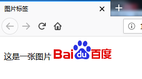

**小细节（注意事项）**

 注意：插入的图片如果显示不出可以将其与该html文件放在一个文件夹下

**总结**

可传图片,规定大小和位置,设置报错提示文本

------


### 程序猿案例

**视频源：**10_案例_程序猿.avi

**需求：** 按效果图写HTML代码

**代码:**

```html
<!DOCTYPE html>
<html>

	<head>
		<meta charset="UTF-8">
		<title>程序猿</title>
	</head>

	<body>
		<p align="center">
			</p>
		<p align="center">
			<font color="red">警告 / WARNING</font>
			
		</p>
		<p align="center">
			<font face="宋体">
			本物品內容可能看不明白；不可將本物品內容派發，傳閱，出售，出租，交給<br /> 或出借予年齡非程序猿的人士出示，播放或播映。</font>
		</p>
		<p align="center">
			<font face="Verdana">
			This article contains material which may offernd and may not be distributed, circulated, sold, hired, given, lent, shown,<br /> played or projected to a person under the age of 18 years. All models are 18 or older. </font></p>
		<p align="center"> </p>
	</body>

</html>
```

**运行结果**

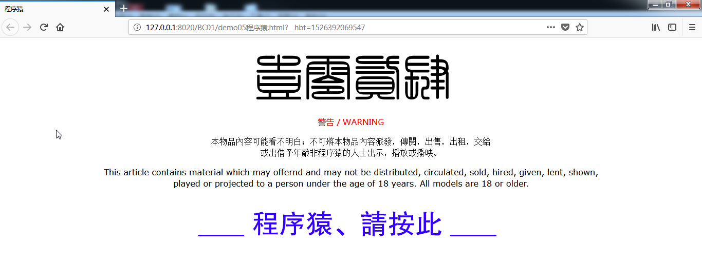

------


### 列表标签

**视频源：**11_列表标签.avi

**概念：** ol(ordered list)有序列表;ul(unordered list)无序列表,用图形做序列;li(list item)列表项目

```html
<ol>
属性:type,指定序号类型
start,执行序号起始值
  	<li>...</li>
</ol>

<ul>
属性:type
</ul>
  
```

**代码:**

```html
<!DOCTYPE html>
<html>
	<head>
		<meta charset="UTF-8">
		<title>彩哥培训班</title>
	</head>
	<body>
		<ol>						//有序列表ol默认用阿拉伯数字做序号
			<li></li>
			<li></li>
			<li></li>
		</ol>
		
		<ol type="1" start="5">		//规定用阿拉伯数字做序号,从5开始标
			<li>包</li>
			<li>教</li>
			<li>包</li>
			<li>会</li>
		</ol>
		
		<ol type="a">				//规定用字母做序号
			<li>你</li>
			<li>是</li>
			<li>谁</li>
		</ol>
		
		<ul type="disc">			//用实心圆点做无序列表序号
			<li>从</li>
			<li>零</li>
			<li>开</li>
			<li>始</li>
		</ul>
	</body>
</html>
```

**运行结果**

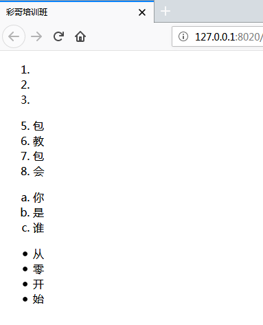

**小细节（注意事项）**

 注意：不用刻意记忆有几种有序和无序序号样式,用Hbuilder编译时会自动提示或按Alt+/提示

有序列表默认用阿拉伯数字做序号,无序列表默认用disc实心圆做序号

**总结**

编写有序列表标签ol(ordered list),无序列表标签ul(unordered list),用li(list item)作为子标签

------


### 超链接a标签

**视频源：**12_a标签.avi

**概念：** 用作超链接的标签

```html
<body>
  <a>
  属性:href,跳转的地址.不清楚超链接要跳转到那里去的时候,也要写一个占位符,跳转到外站要从网址的协议开		始写,如:"http://www.baidu.com"
  target : 指定使用什么样的方式打开新的页面,取值_blank在新窗口打开链接地址，_parent关闭当前网页切换到链接地址网页，_self关闭当前网页切换到链接地址网页，_top关闭当前网页切换到链接地址网页，search在新窗口打开链接地址

```

**代码:**

```html
<!DOCTYPE html>
<html>
	<head>
		<meta charset="UTF-8">
		<title>彩哥培训班</title>
	</head>
	<body>
		<a href="http://www.baidu.com" target="_parent">百度1</a></br>
		<a href="http://www.baidu.com" target="_blank">百度2</a></br>
		<a href="http://www.baidu.com" target="_search">百度3</a></br>
		<a href="http://www.baidu.com" target="_top">百度4</a></br>
		<a href="http://www.baidu.com" target="_self">百度5</a></br>
	</body>
</html>
```

**运行结果**

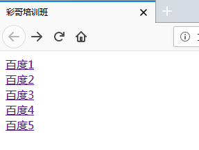

**小细节（注意事项）**

 注意：不清楚超链接要跳转到那里去的时候,也要写一个占位符

```html
<a href="#"></a>
```

------


### 案例友情链接

**视频源：**13_案例_友情链接.avi

**需求：** 在网页上用无序列表做黑马程序员\传智播客和CSDN的友情链接

**代码:**

```html
<!DOCTYPE html>
<html>

	<head>
		<meta charset="UTF-8">
		<title>友情链接</title>
	</head>

	<body>

		<ul>			
			<li>
				<a href="http://www.itheima.com">黑马程序员</a>
			</li>
			<li>
				<a href="http://www.itcast.cn">传智播客</a>
			</li>
			<li>
				<a href="http://www.csdn.net">CSDN</a>
			</li>
		</ul>

	</body>

</html>
```

**运行结果**

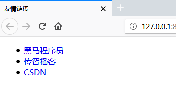

------


### 案例回到顶部

**视频源：**14_案例_回到顶部.avi

**需求：** 浏览到网页底部时点击链接可返回顶部

**代码:**

```html
<!DOCTYPE html>
<html>

	<head>
		<meta charset="UTF-8">
		<title>回到顶部</title>
	</head>

	<body>
		<p id="top">1</p>
		<p>1</p>
		<p>1</p>
		...
		<p>1</p>
		...
		<a href="#top">回到顶部</a>
		
	</body>

</html>
```

**运行结果**

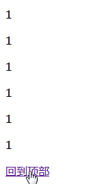

**总结**

在顶部段落标签中定义id属性设值为top,在底部添加a标签定义超链接的属性值为#top

------


### 表格标签

**视频源：** 15 _ 基本表格.avi，16_ 表格的属性.avi，17_ 表格的结构标签.avi ，18_ 行和列的删除.avi，19_单元格的合并.avi

**知识点：** 

1. 表格标签的基本使用
2. 表格结构标签 
3. 表格行列删除 
4. 单元格合并

**概念：**

1. 表格标签的基本使用< table >  < tr > < td >
2. 表格结构标签 < thead > < tbody > < tfoot > 
3. 表格行列删除：删除表格的一行或一列 
4. 单元格合并 ：将表格的某些单元格合并为一个单元格

**需求：** 

**代码:**

```
//普通表格
<!DOCTYPE html>
<html>
	<head>
		<meta charset="utf-8" />
		<title></title>
	</head>
	<body>
		
		<table>
			<tr>
				<th>ID</th>
				<th>name</th>
				<th>age</th>
			</tr>
			<tr>
				<td>001</td>
				<td>尼古拉斯赵四</td>
				<td>16</td>
			</tr>
			<tr>
				<td>002</td>
				<td>尼古拉斯贤</td>
				<td>25</td>
			</tr>
		</table>
		
		
		//表格结构标签thead tbody
		<table>
			<caption>会员等级</caption>
			<thead>   
				<tr>
					<th>ID</th>
					<th>name</th>
					<th>age</th>
				</tr>	
			</thead>
			
			<tbody>
				<tr>
					<td>001</td>
					<td>尼古拉斯赵四</td>
					<td>16</td>
				</tr>
				
				<tr>
					<td>002</td>
					<td>西门吹雪</td>
					<td>25</td>
				</tr>
			
			</tbody>
			
		</table>
		
	</body>
</html>
```

**运行结果**

```

```

**小细节（注意事项）**

表格可以嵌套表格

```

```

**总结**

普通表格标签：
< table >表格  

* 子标签：
  * < tr > 行标签   
  * < caption >标题标签，必须是table的第一个子标签
* 子子标签：
  * < td > 单元格标签  
  * < th > 表头标签

  table及子标签属性：

* border  边框
* align 对齐方式
* width 宽度
* cellpadding 内边距
* cellspacing 外边距， 其默认值是1px，可以设置为0取消边距


表格结构标签

由于表格加载时会作为一个整体，效率不高，为了提高用户体验，表格应该使用结构标签
< thead > 表头
< tbody > 表内容
< tfoot > 表尾
三者改变位置不影响

tips：表格可以嵌套表格


### 框架标签

**视频源：** 20_框架集.avi

**知识点：** 框架标签及其用法

**概念：**

1. 框架标签的使用场景：主要用在后端界面
2. 框架标签的使用方法：< frameset > 和< frame >

**需求：** 

**代码:**

```
//创建一个框架集
<!DOCTYPE html>
<html>
	<head>
		<meta charset="UTF-8">
		<title></title>
	</head>
	
	<frameset rows="20%, 70%, 10%">
		<frame src=""/>
		<frameset cols="20%, *">
			<frame src="" />
			<frame src="" />
		</frameset>
		<frame />
		
		
	</frameset>
	
</html>
```

**运行结果**

```

```

**小细节（注意事项）**

框架标签不能和body标签共存

```

```

**总结**

框架标签（有框架标签就不能有body标签）

* 属性： 
  * src 指定引用路径，可以是html页面，被引用的页面不需要完整结构，只需要页面内容即可


### 表单标签

**视频源：**21_ 基本表格.avi，22_ 下拉框和文本域.avi ，23_ 常用属性和默认值.avi，24_ 表单的属性.avi

**知识点：** 表单使用方法

**概念：**

1. 几种常用的表单使用
2. 表单中的主要属性

**需求：** 

**代码:**

```html
<!DOCTYPE html>
<html>

	<head>
		<meta charset="UTF-8">
		<title></title>
	</head>
	
	<body>
	
		//input表单
	
		账号<input type="text" name="acount" id="" value="" /> <br /> 
		密码<input type="password" name="password" id="" value="" /><br /> 
		性别 <input type="radio" name="gender" id="" value="男" />男
		<input type="radio" name="gender" id="" value="女" />女 <br /> 
		兴趣爱好 <input type="checkbox" name="hobby" id="" value="" />
		篮球<input type="checkbox" name="hobby" id="" value="" />
		足球<input type="checkbox" name="hobby" id="" value="" />
		羽毛球<br />
		<input type="submit" name="submit" id="" value="提交" />
	
		//select下拉表单
		家乡 <select name="city">
			<option value=""> 北京</option>
			<option value=""> 上海</option>
			<option value=""> 深圳</option>
			<option value=""> 广州</option>
		</select>
		
		//文本域表单
		自我介绍 <textarea></textarea>
	
	</body>

</html>
```


**运行结果**

```

```

**小细节（注意事项）**

```

```

**总结**

表单标签

* < form >标签
  * 属性：	
    * action  ：规定当提交表单时向何处发送表单数据。
    * method ：两种数据传递给后台的方式
      * get 请求，在原地址后面以? 拼接参数，传递给后台，key = value的形式去拼接，多个参数用&连接，传输数据大小最大一般是1kb
      * post请求，数据隐藏起来，相对来说更加安全，传文件一定要用post，其传输大小由后台服务器决定


* 子标签< input >（普通输入框）
  * 通用属性：
    * name 数据要传输给后台，必须指定该属性
    * value 指定按钮上的文本，以及指定选择框（单选和复选）传递给后台的数据
  * 属性：
    * type 指定输入框类型
      * 默认text 文本输入框
      * password密码输入框（不可见）
      * radio单选框（通过name将单选框分组）
      * checkbox复选框
      * file 文件选择框
      * submit 提交框
      * reset 情况框
      * button 自定义按钮
      * hidden 隐藏域
      * image 图片提交 ，不常用
      * placeholder 指定框内显示的提示文本

    ​

* 子标签select（下拉框）   嵌套  < optgroup > < option > 
* 子标签textarea (文本域)


