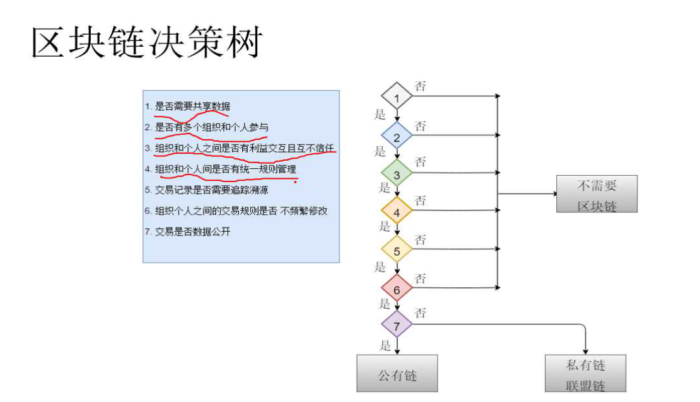

##区块链入门 
###实质是一个分布式系统(账本)

###分布式账本
* 比特币不是一种货币, 是一种记录价值转移的过程
* 比特币本身没有价值

###两个问题(hash函数解决)
* 隐私问题：hash函数将信息加密化, 首先生成私钥, 私钥需要保存好, 通过私钥生成公钥, 公钥一般为地址值
* 快速对账问题：通过hash码进行快速对账

###hash 算法 :

通过一种算法将数据转化为同样长度的哈希码，无法反向解码，主要的哈希算法有以下几种：

* SHA256  64位 2的256次方种可能
* SHA512  128位 2的512次方种可能
* SHA1 谷歌已经检测出一次碰撞，因此存在安全性问题
* MD5 32位 通过穷举方法已有网站可以将哈希码解码为数据，因此存在安全性问题

###分布式系统和一致性

* 比特币通过p2p技术实现账本的同步拷贝
* 比特币通过增加发送信息的成本(pow)来增加信息传播的成本,降低信息传播的速率
* 比特币通过区块链的长度,来判断数据的可信度
* 交易中6个有效区块认为转账成功. 所以比特币的交易确认需要1小时
* Pow通过sha256哈希来完成, 后面单独介绍
* 工作证明的获取需要很长时间, 但是验证只需要很短时间.
* 比特币的Pow算法导致大家通过矿池来挖矿, 矿池算力垄断. 有潜在的中心化风险.
* 矿池挖矿只是在抢夺记账权,获得比特币,消耗大量电力,并无实际价值,我国计划取缔挖矿.

###区块链的实质
**区块链的实质是把链下的信任体转移到链上, 把信任某个组织或人改为信任某个机制**

##区块链的演化

###计算机程序设计 = 数据结构 + 算法

###主要演化
* 区块链1.0：比特币
	* 数据结构——张三 100， 李四 50 
	* 算法——加减乘除，简单记账
	* 世界状态变化—— 100，50 -> function() -> 90，65
* 区块链2.0：以太坊 （可编程区块链，但缺点是语言支持不强）
	* 数据结构——整型，数组，map，结构体等
	* 算法（智能合约）——图灵完备的虚拟机中执行的程序
	* 世界状态变化—— 00001111 ->  function() -> 10110110
* 区块链3.0：Hyperledger
	* 数据结构——任意数据结构
	* 算法——Nodejs, java, go, python编写的chaincode
	* 世界状态变化—— 00110101 -> 全功能function() -> 01010100

###区块链关键技术
密码学, hash, 数字签名
分布式共识(pow, pos, dpos, poe)

例如工作证明Pow: 获得证明需要很长时间, 验证只需要很短时间

###现有产品性能
* 比特币 : 7笔/秒，由于Pow的挖矿时间成本导致
* 以太坊 : 15笔/秒，由于Pow的挖矿时间成本导致
* Hyperledger：百万笔/分钟

##区块链适合的场景

###适合的应用场景
* **有共享通用数据库的需要**
* **流程设计的参与方存在利益冲突, 或者在参与方之间没有信任**
* **数据库的写入者有多个**
* **交易频次不超过10000次/秒**

###不适合的应用场景:
* **业务设计机密数据 **
* **业务过程存储大量静态数据, 或者数据非常大**
* **交易规则经常变化**
* **使用外部或者三方服务来收集/存储数据**

###区块化的成本:
* **计算成本: 服务器, 挖矿**
* **存储成本**
* **安全成本**
* **隐私成本**
* **易用性成本**

###IPO、ICO和DAICO
DAO Dcententralize Autonomous Organization
DAICO 众筹(股东有权决定资金流向)

corda 银行机构区块链应用

##区块链分布式系统的核心问题

###一致性问题
* 什么是一致性
	* 对分布式系统的多个节点给定一系列操作，在协议保障下，使处理结果一致，例如：电影票双花问题
* 一致性的通用解决方案和挑战：**解决的思想是把并行的东西给串行化**
	* 两个系统采用同一个的数据中心
	* 不同系统分时段操作（两个系统分时段买票）
	* 一个系统进入卖票页面后锁死，禁止其他系统进入
* 一致性的安全问题
* 强一致性和弱一致性
 
###共识协议
* 人民代表大会制度
* 提案（proposal）
* 共识达成的问题和挑战
	* 非拜占庭错误：节点故障，响应请求延时，网络故障等
	* 拜占庭错误： 黑客入侵等情况导致节点恶意响应
	
	**FLP不可能原理：异步通信场景中，没有任何一个算法能保证到达一致性。 该原理从科学上证明在极端情况下总会出现不一致的情况；但在工程中，通过付出一些代价，可以将其变为可能**

###CAP原理

* 一致性 : consistency 
* 可用性 : availability
* 分区容忍性 : partition

例：比特币的交易性能很低，只有3笔/秒；要提高比特币的性能可以通过短暂的允许侧链，即允许短暂的不一致（降低一致性），或先冻结交易的货币，再同时进行处理，即降低资金可用性，或将网络分区，提高分区容忍性。分布式系统的一切优化CAP原理，必将牺牲其中的一些性能，不可能完美满足三者

**程序设计中的时间和空间：大多数情况下程序优化时，时间和空间不可兼得，例如IO流中的文件复制，通过建立byte数组可以极大提高复制速度，但会增加空间消耗**

###常见分布式共识算法
* Paxos：算法中的节点分为三种类型
	* proposer 提出一个天，等待大家批准为结案
	* accessptor 负责对天进行投票
	* learner 被告知结案结果，并与之统一，不参与投票过程

* Raft：基于paxos的简易实现

###分布式系统的可靠性

通过消灭单点，让多个节点同时参与集体完成原先的单点工作，可以从概率上提高可靠性（毕竟几个节点同时故障的可能性很低）。

