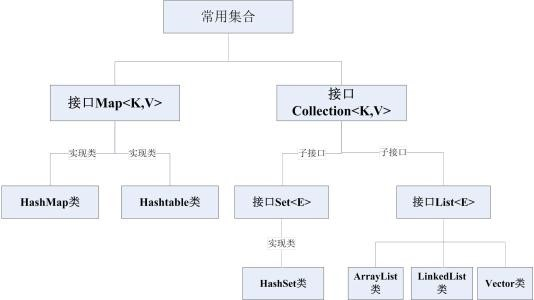

##集合

###集合的演变
* 数组：长度固定
* ArrayList：长度可变
* HashSet：长度可变，不可重复
* TreeSet：长度可变，不可重复，自动排序
* HashMap：可存放键值对

###集合的线程安全和效率
* Hashmap 线程不安全，效率高 
* HashTable 线程安全，效率低
* ArrayList 线程不安全，效率高  
* Vector 线程安全，效率低

###三种集合
* 只读集合
	* List类： 通过listOf创建
	* Set类： 通过setOf创建
	* Map： 通过mapOf创建

* 可读可写集合
	* MutableList： 通过mutableListOf创建
	* MutableSet： 通过mutableSetOf创建
	* MutableMap： 通过mutableMapOf创建

* java中的集合（例如ArrayList）可以直接用

###map集合的几个字段
* map.keys 遍历所有的key
* map.values 遍历所有的value
* map.entrys 遍历所有键值对 同for((key, value) in map) { .... }

##函数式编程
###面向对象编程和函数式编程
* OOP：面向对象编程，一切皆对象
* FP：函数式编程，一切皆函数，没有线程安全问题，适合高并发编程
* kotlin是以FP编程为辅助工具的OOP编程

###闭包 
函数是不保存状态的，但闭包可以保存函数的状态

###高阶函数
* 定义：参数或者返回值是为函数的函数

		fun cacl(a: Int, b: Int, block: (Int, Int) -> Int):Int {
		    return block(a, b)
		}

* 函数的引用 （::）  例如：  ::add 即对add方法的引用

		var sum = cacl(1, 2, ::add)
* 作用：提高扩展性，根据不同情况传入不同函数处理

###lambda表达式
* 定义：lambda表达式即匿名函数
* 有参lambda和无参lambda
		
		{ println("这是无参lambda")}()   //无参lambda表达式
		
		{ a: Int, b: Int -> a + b }(1, 2) //有参lambda表达式

###lambda表达式的两种简化
* lambda表达式括号前移（一种简化方法，可以不用）
		
		fun cacl(a:Int, b:Int, block: (Int, Int)-> Int) {....}

		cacl(3, 2, {a, b-> a + b})
		//简化为
		cacl(3, 2) {
	        a, b -> a + b
	    }

	* 条件：高阶函数调用时传入参数的最后一个参数为lambda表达式时
	* 用法：将尾部的小括号前移，lambda表达式放最后

* lambda表达式使用时如果只有一个参数可以省略参数名，默认传入it，lambda表达式返回不用return， 默认是最后一行的值 

		var str = "abcdef"
    
	    str.forEach { c: Char ->
	        println(c)
	    }

		//简化为：

		var str = "abcdef"
    
	    str.forEach { 
	        println(it)
	    }

###foreach及其演化流程
	//foreach中传入函数引用
	str.forEach(::println)
	
	//用lambda表达式代替函数引用
    str.forEach({c: Char ->
        println(c)
    })
	
	//括号提前，由于括号中无参，可以去掉
    str.forEach() { c: Char ->
        println(c)
    }
	
	//只传入一个参数可以不用写，用it代替
    str.forEach {
        println(it)
    }

###list集合的高阶函数
* 过滤： 
	* filter找一类符合条件的数据，返回集合
	* find找一个符合条件的数据，返回<T>类型数据
	* fiterTo 将一个集合中符合过滤条件的元素传入另一个集合中
		
		//Iterable迭代器接口，集合都实现了迭代器
		fun Iterable<T>.filter(predicate: (T) -> boolean): List<T> { }
		

* 排序：
	* 正序sorted()
	* 倒序sortedDescending()
	* 按字段排序
		
			val list = arrayListOf<Person>(Person("尼古拉斯赵四",12),Person("尼古拉斯小贤",15),Person("尼古拉斯",6))

		    val list2 = list.sortedBy {
		        it.age
		    }
		
		    println(list2)

* 分组（groupBy）：

		groupBy { }

* 最值：用法和sorted类似

		list.maxBy { it: Person
			it.age
		}//获取Person类中年龄最大的

		list.minBy { it: Person
			it.age
		}//获取Person类中年龄最小的

* 去重复：
	* distinct() 简单去重
	* distinctBy{ // 可以根据需求去重 }

		    val list = arrayListOf<Person>(Person("尼古拉斯赵四",12),Person("尼古拉斯贤",15),Person("尼古拉斯飞",6),Person("我",6))

	    	val list2 = list.distinctBy {
		        it.name.startsWith("尼古拉斯")
		    }
		    
		    println(list2)//只剩下尼古拉斯赵四和我

* 集合的拆封（partition）：

		val list = arrayListOf<Person>(Person("尼古拉斯赵四",12),Person("尼古拉斯小贤",15),Person("我",6))

	    var pair = list.partition {
	        it.name.startsWith("尼古拉斯")
	    }
	
	    println(pair.first) //尼古拉斯赵四和小贤
	    println(pair.second) //我

* 集合重新组合：

		val list = arrayListOf<Person>(Person("张三",12),Person("李四",15),Person("王五",6))

	    println(list.map {
	        it.name = "@" + it.name
	        it
	    })

###四大函数：
* apply（主要作用： 大范围的空值处理）
	1. 任意类型都有该扩展函数
	1. 传入参数：T.() -> Unit 代表传入的函数参数是在T里面的函数，可以访问T对象里面的字段或方法，调用时需要T().调用
	1. lambda表达式里面this代表调用的对象，可以访问对象里面的方法

* let
	1. 任意类型都有该扩展函数
	1. 传入参数是函数，block: (T) -> R 该函数参数是调用者本身
	1. 返回值是函数参数的返回值R

* with
	1. 不是扩展函数，是独立的函数，可以在任意地方调用
	1. 需要接受两个参数，第一个可接受任意类型，第二个是带接收者的函数参数T.()-> R
	1. 返回值是第二个函数参数的返回值

* run
	1. 任意类型都有run扩展函数
	1. 参数是带接受者的函数类型T: () -> R，接受者是调用者本身
	1. 返回值是函数参数的返回值

###接口回调和函数回调
* 接口回调流程
	1. 定义具备某种能力的接口
	1. 传递接口对象给SuperMarket
	1. SuperMarket通过接口对象将数据传回去
	1. 在具有能力的对象方法下进行接收

* kotlin可以直接函数回调（流程和接口回调类似，参考老师的代码）

